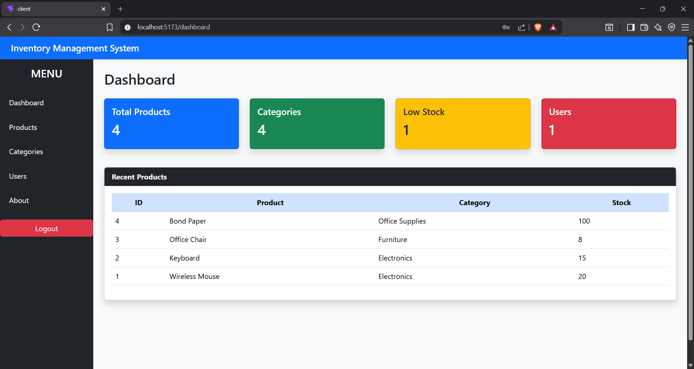
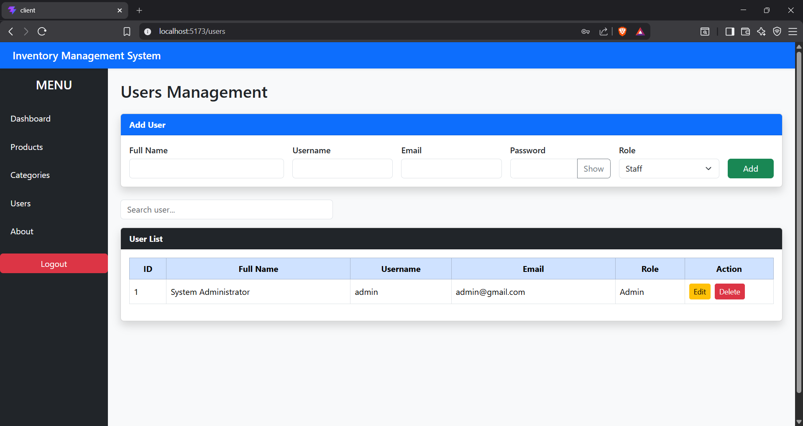
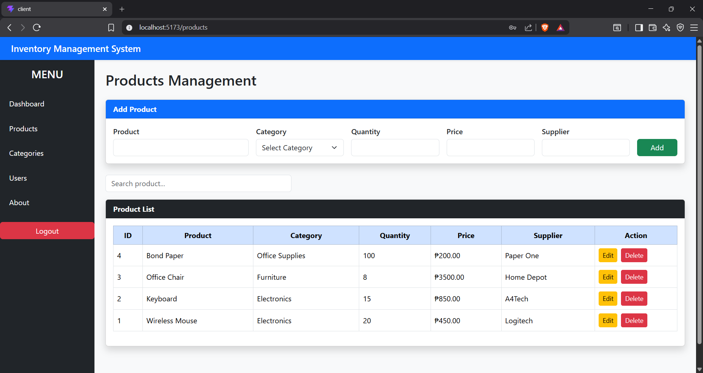
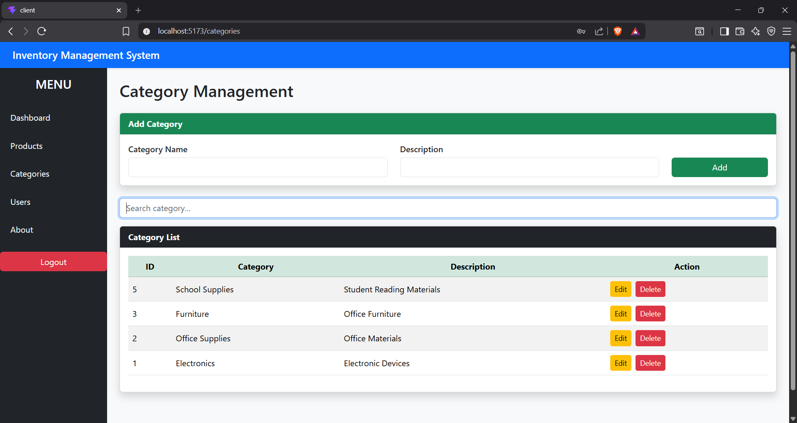

# YOTAP-SYSTEM

A web-based **YOTAP Management System** built using **React (Vite)** for the frontend and **PHP + MySQL** for the backend. The system provides user management, product management, category management, authentication, and an admin dashboard.

## Features

- 🔐 User Authentication (Login & Register)
- 👤 User Management (CRUD)
- 📦 Product Management (CRUD)
- 🗂️ Category Management (CRUD)
- 📊 Admin Dashboard
- 🔍 Search Functionality
- 🎨 Responsive User Interface
- 🗄️ MySQL Database Integration

## Technologies Used

### Frontend
- React
- Vite
- Axios
- React Router
- CSS

### Backend
- PHP
- MySQL
- XAMPP

## Project Structure

```
YOTAP-SYSTEM/
│
├── client/                 # React Frontend
│   ├── src/
│   ├── public/
│   ├── package.json
│   └── vite.config.js
│
├── server/
│   ├── api/
│   ├── config/
│   ├── controllers/
│   ├── models/
│   ├── index.php
│   └── package.json
│
└── README.md
```

## Installation

### 1. Clone the Repository

```bash
git clone https://github.com/castanedajohnclarence7-ai/YOTAP-SYSTEM.git
```

### 2. Open the Project

```bash
cd YOTAP-SYSTEM
```

### 3. Install Frontend Dependencies

```bash
cd client
npm install
```

### 4. Start the React Application

```bash
npm run dev
```

The frontend will run on:

```
http://localhost:5173
```

### 5. Configure the Backend

1. Copy the **server** folder into your XAMPP `htdocs` directory if necessary.
2. Start **Apache** and **MySQL** using XAMPP.
3. Import your MySQL database into phpMyAdmin.
4. Update your database connection settings inside the `server/config` folder if needed.

## Usage

- Register a new account or log in.
- Admin users can manage:
  - Users
  - Products
  - Categories
- View the dashboard and system data.

## Screenshots

### Dashboard



### Users



### Products



### Categories



## Future Improvements

- User Roles and Permissions
- Export to PDF/Excel
- Dark Mode
- Activity Logs
- Notifications

## Author

**John Clarence Castañeda**

GitHub:
https://github.com/castanedajohnclarence7-ai

## License

This project is for educational purposes.